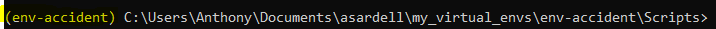

# Création d'environnement virtuel et Data Science

## OBJECTIFS

Voici les objectifs de ce cours :
- [x] Comprendre l'importance des environnements virtuels
- [x] Créer des environnements virtuels
- [x] Installer des librairies python
- [x] Exporter et importer un environnement
- [x] Utiliser des librairies de data science

## TD2

Dans ce TD, vous utiliserez le même repository  `iut_sd3_accidents` de la séance précédente. Pour simplifier le versionnement de votre projet, vous pouvez utiliser GitHub Desktop à la place des commandes Git Bash si vous le souhaitez. Merci de mettre votre repository en public et de m'envoyer le lien de votre repository par mail en fin de session.

### Exercice 1 - Création d'environnement virtuel

Toutes les questions de cet exercice sont à réaliser dans l'invite de commandes. Attention, les commandes peuvent-être différentes si vous n'êtes pas sur un environnement Windows.

1. Ouvrer une fenêtre d'invite de commandes.

2. Vérifier que Python 3 est bien installé sur votre machine avec la commande suivante :
```
python --version
```
ou
```
python -V
```
Si ce n'est pas le cas, installez Python 3

3. Vérifier le chemin d'installation de Python sur votre système avec la commande suivante :
```
where python
```

4. Lister les librairies Python actuellement installées sur votre système avec la commande suivante : 
```
pip list
```

5. Avant d'aller plus loin, un peu de lecture sur l'intérêt de créer en environnement virtuel : [cliquez-ici](https://www.docstring.fr/glossaire/environnement-virtuel)

6. Installer la librairie *`virtualenv`* sur votre environnement Python par défaut avec la commande suivante : 
```
pip install virtualenv
```

7. Vérifier que la librairie est correctement installée  avec la commande suivante : 
```
pip list
```

8. Créer un environnement virtuel appelé `env-accident` avec la commande suivante : 
```
py -m venv env-accident
```
`-m` est une option qui indique à l'interpréteur Python d'exécuter un module en tant que script.


Il faut bien penser à changer de chemin et vous positionner dans le dossier où vous souhaitez créer votre environnement virtuel. Voici un exemple : 
```
cd C:\Users\Anthony\Documents\asardell\my_virtual_envs
```

Pour rappel, la commande `cd` pour *change directory* permet de se déplacer de dossier en dossier en changeant le chemin du répertoire courant.
Une fois dans le bon dossier vous pouvez créer votre environnement.

:warning: Ne pas utiliser créer votre environnement virtuel dans votre dossier projet.

### Exercice 2 - Activer son environnement virtuel

Toutes les questions de cet exercice sont à réaliser dans l'invite de commandes. Attention, les commandes peuvent-être différentes si vous n'êtes pas sur un environnement Windows.

1. Avant d'aller plus loin, lire attentivement cette partie du cours de l'exercice 1 : [cliquez-ici](https://www.docstring.fr/glossaire/environnement-virtuel/#comment-activer-un-environnement-virtuel-python)

2. Se déplacer jusqu'au fichier d'activation `activate.bat` de l'environnement avec les commandes suivantes : 
```
cd ./env-accident/Scripts
```
```
activate.bat
```
`./` permet d'éviter de récrire tous le chemin relatif.

3. Vérifier sur votre terminal que l'environnement est bien activé.



4. Désactiver votre environnement avec la commande suivante : 
```
deactivate
```
On remarque que l'environnement est désactivé.

5. Activer de nouveau votre environnement et afficher la liste des librairies actuellement installées avec la commande suivante :
```
pip list
```

6. Il y a très peu de librairies, installez les librairies `numpy` et `pandas`. Vérifier avec la commande `pip list`.

7. Exporter votre environnement virtuel dans un fichier appelé *requirements.txt* avec la commande suivante : 
```
pip freeze > requirements.txt
```

Cette commande capture la liste des packages installés avec leurs versions exactes et les enregistre dans un fichier *requirements.txt* qui sera créé dans le **répertoire actuel**.


Dans cette question on souhaite enregistrer le fichier *requirements.txt* à la racine de votre repository local.

8. Désactiver votre environnement et fermer le terminal de commande.

9. Créer un autre environnement virtuel appelé `test-env` pour faire un test uniquement dans le cadre de cet exercice.

10. Le fichier *requirements.txt* généré dans la question précédente peut ensuite être partagé avec d'autres personnes ou utilisé pour recréer un environnement Python. Pour installer les dépendances à partir de ce fichier, vous pouvez utiliser la commande suivante :
```
pip install -r requirements.txt
```

:warning: Il faut se placer dans le répértoire où le fichier est présent sinon il sera introuvable.

11. Vérifier que les librairies du fichier *requirements.txt* ont bien été installées sur l'environnement `test-env`.

### Exercice 3 - Utiliser son environnement virtuel dans Visual Studio Code

Toutes les questions de cet exercice sont à réaliser sur la branche *`DEV`* de votre repository `iut_sd3_accidents` en activant votre environnement virtuel `env-accident`.

1. Ouvrer Visual Studio Code et activer votre environnement depuis un invite de commandes *cmd* de VS Code. 

2. Créer un script python appelée *`step2.py`* à la racine de votre projet. Ajouter une ligne de code dans le script :
```
print("Bon courage pour la suite")
```

3. Tester l'exécution du script *`step2.py`*. Pour cela, naviguez dans l'invite de commandes *cmd* de VS Codeun vers le répertoire où se trouve votre script Python en utilisant la commande `cd`. Une fois que vous êtes dans le bon répertoire, vous pouvez exécuter votre script en utilisant la commande :
```
python step2.py 
```
4. Le résultat de votre print s'affiche dans la console.

### Exercice 4 - Préparation des données

Toutes les questions de cet exercice sont à réaliser sur la branche *`DEV`* de votre repository `iut_sd3_accidents` en activant votre environnement virtuel `env-accident`. Pensez à mettre des commentaires dans votre script !

:warning: Vous aurez besoin du fichier *`/step1/merged_data.csv` pour faire cet exercice.


1. Utiliser le script *`step2.py`* pour traiter la partie *Traitement des valeurs manquantes* du tutoriel d'[Ilyes Talbi](https://larevueia.fr/xgboost-vs-random-forest-predire-la-gravite-dun-accident-de-la-route/)

- Créer un dossier *`step2` à la racine du projet.
- Exporter dans ce dossier le dataframe avec les valeurs manquantes traitées dans un fichier appelé *`missing_values_deleted.csv`*
- Exporter dans ce dossier le ou les graphiques de cette étape au format *.png*.

2. Créer un script *`step3.py`* pour traiter la partie *Encodage de hrmn, du mois* du tutoriel d'[Ilyes Talbi](https://larevueia.fr/xgboost-vs-random-forest-predire-la-gravite-dun-accident-de-la-route/)

- Créer un dossier *`step3` à la racine du projet.
- Exporter dans ce dossier le dataframe avec l'encodage de `hrmn`, du `mois` dans un fichier appelé *`time_encoding.csv`*

3. Créer un script *`step4.py`* pour traiter la partie *Encodage de la position GPS* du tutoriel d'[Ilyes Talbi](https://larevueia.fr/xgboost-vs-random-forest-predire-la-gravite-dun-accident-de-la-route/)

- Créer un dossier *`step4` à la racine du projet.
- Exporter dans ce dossier le dataframe avec l'encodage de `gps` un fichier appelé *`gps_encoding.csv`*

:warning: Vous n'avez peut-être jamais étudié l'algorithme des KMeans qui permet de faire du *Clustering*, pas de panique. Pour comprendre les grands principes, vous pouvez lire cette [documentation](https://blent.ai/blog/a/k-means-comment-ca-marche) et/ou jouer avec cette [démo](https://www.naftaliharris.com/blog/visualizing-k-means-clustering/)

4. Créer un script *`step5.py`* pour traiter la partie *Encodage One-Hot des variables catégoriques* du tutoriel d'[Ilyes Talbi](https://larevueia.fr/xgboost-vs-random-forest-predire-la-gravite-dun-accident-de-la-route/)

- Créer un dossier *`step5` à la racine du projet.
- Exporter dans ce dossier le dataframe avec l'encodage One-Hot des variables catégoriques dans un fichier appelé *`one_hot_encoding.csv`*

### Exercice 5 - Analyse Data Science

Toutes les questions de cet exercice sont à réaliser sur la branche *`DEV`* de votre repository `iut_sd3_accidents` en activant votre environnement virtuel `env-accident`. Pensez à mettre des commentaires dans votre script !
Dans cette exercice, on cherche à prédire la gravité d'un accident d'après la variable `grav`.

1. Construire l'échantillon d'apprentissage et de test.

- Créer un dossier *`step6`
- Exporter dans ce dossier l'échantillon *train* dans un fichier appelé *`train.csv`*
- Exporter dans ce dossier l'échantillon *test* dans un fichier appelé *`test.csv`*

2. Tester un modèle d'arbre de décision et calculer les métriques d'évaluations usuelles.

3. Tester un modèle de KNN et calculer les métriques d'évaluations usuelles.

4. Tester un modèle de Régressin logistique et calculer les métriques d'évaluations usuelles.

5. Exporter à la racine du projet le meilleure modèle dans un fichier appelé *`best_model.pkl`* , voici [un exemple](https://practicaldatascience.co.uk/machine-learning/how-to-save-and-load-machine-learning-models-using-pickle) .

6. N'oubliez pas de `commit` puis `push` sur votre branche *`DEV`*

## LIENS UTILES

Voici quelques liens utiles qui pourrait vous aider durant ce projet :

- [Environnement virtuel](https://www.docstring.fr/glossaire/environnement-virtuel)
- [Tutoriel d'Ilyes Talbi de la revue IA](https://larevueia.fr/xgboost-vs-random-forest-predire-la-gravite-dun-accident-de-la-route/)